# Airspace Pulse — Live Mobility Analyzer

A live flight-tracking dashboard built with [Streamlit](https://streamlit.io). It polls [ADSB.lol](https://adsb.lol) for aircraft near ~50 major US airports, enriches each one with real airline/aircraft-type data from OpenFlights and the OpenSky Network, and renders it as a live map plus a set of analytics and experimental visualizations.

**Live demo:** https://airspace-pulse-d2uqtvw4utbb6gumm2aupy.streamlit.app/
*(On the free tier the app sleeps when idle — if you see a sleep screen, click "Yes, get this app back up!" and give it about a minute.)*

<p align="center">
  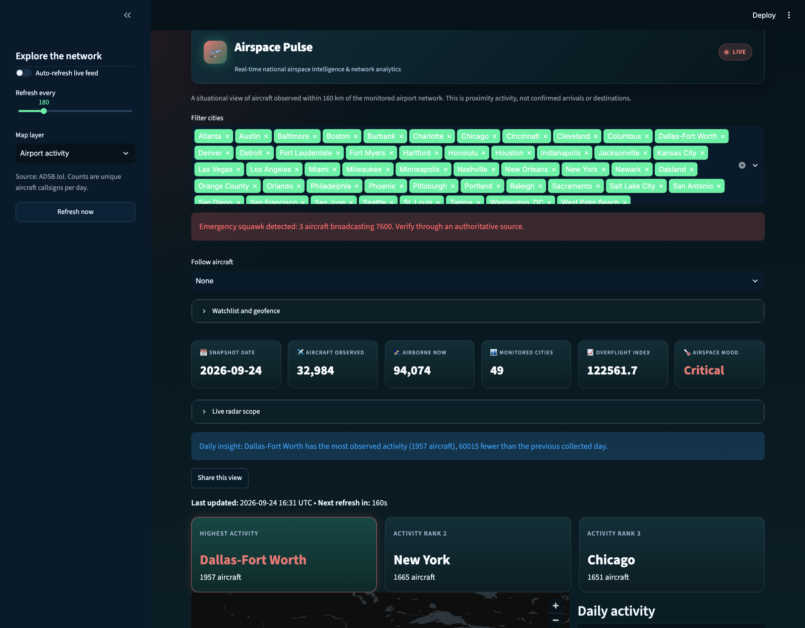
</p>

## Gallery

### Eleven ways to look at the same live data

Switch the map layer from the sidebar. A few of them:

<table>
  <tr>
    <td width="50%">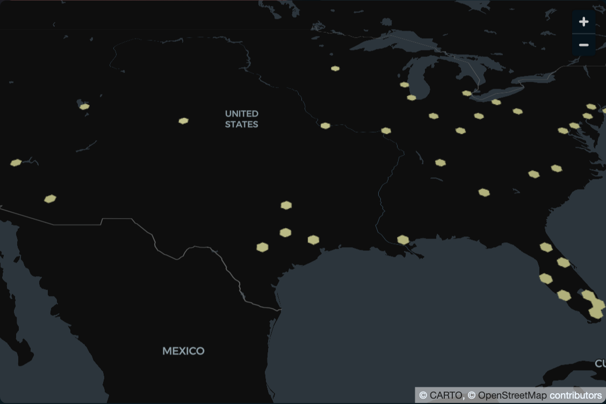<br><sub><b>Airport activity</b> — hexagon density around each monitored airport</sub></td>
    <td width="50%">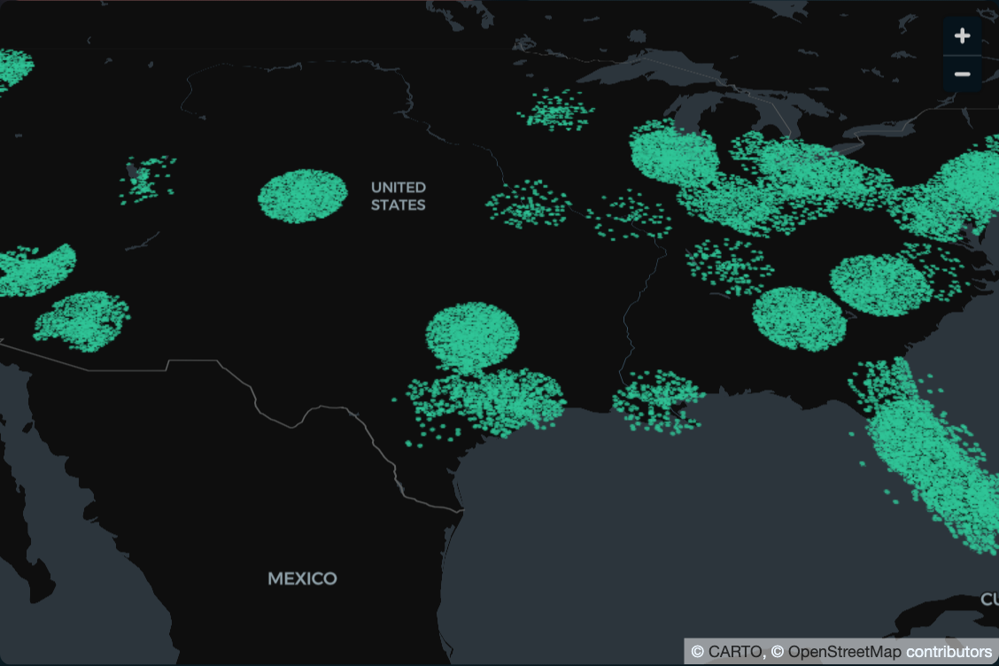<br><sub><b>Aircraft positions</b> — every tracked aircraft</sub></td>
  </tr>
  <tr>
    <td width="50%"><br><sub><b>Network arcs</b> — inferred airport-to-airport traffic</sub></td>
    <td width="50%">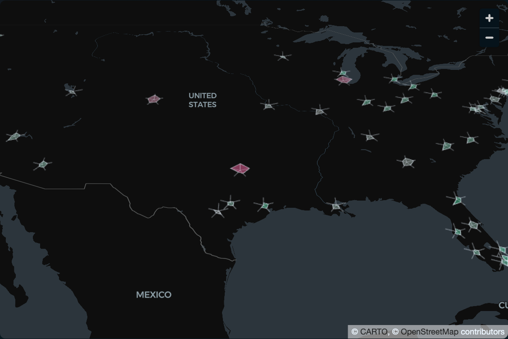<br><sub><b>Star glyphs</b> — a multivariate profile per airport</sub></td>
  </tr>
  <tr>
    <td width="50%">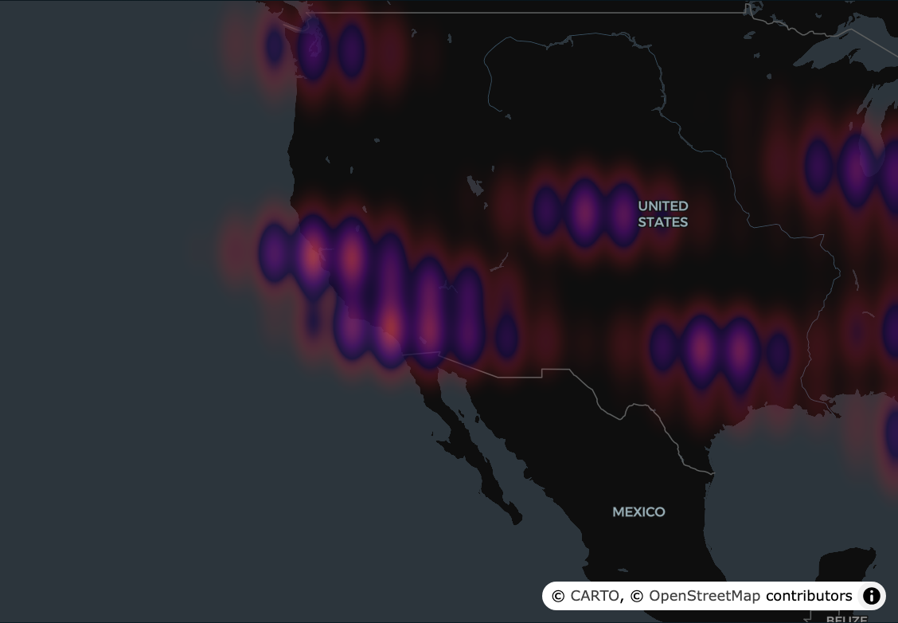<br><sub><b>Density field</b> — smooth kernel density of traffic</sub></td>
    <td width="50%">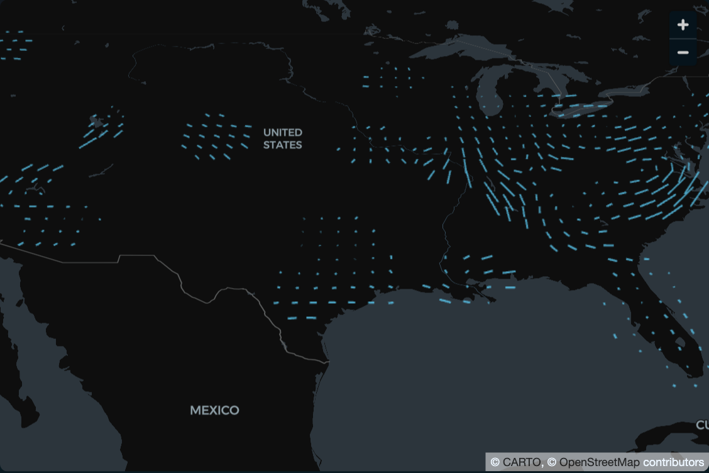<br><sub><b>Flow field</b> — dominant direction of travel</sub></td>
  </tr>
</table>

The other layers are flight trails, 3D altitude, 3D flight trails, controlled airspace, and wake-vortex trails. The last two depend on which aircraft are in the current snapshot, so they can be sparse.

### Live radar

<p align="center">
  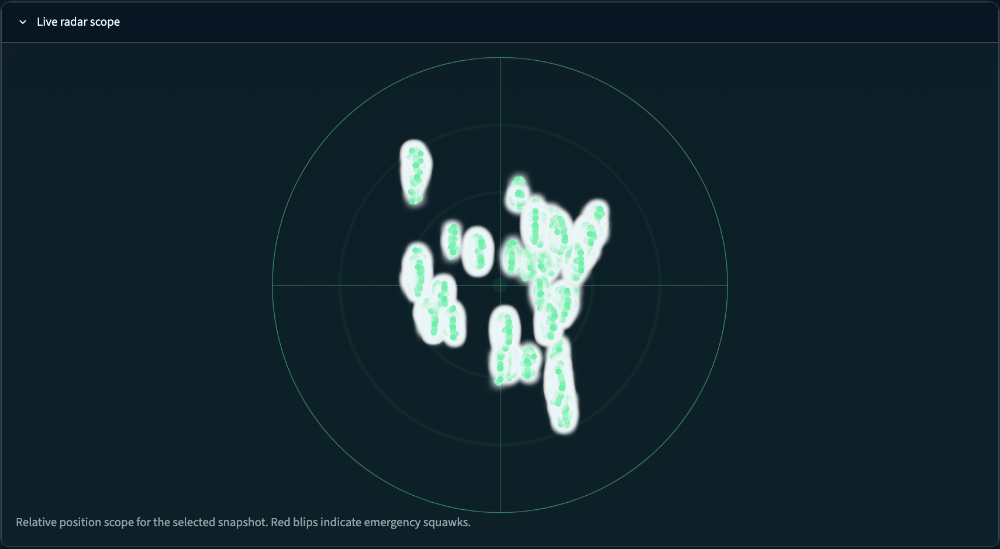
</p>

### Analytics

Forecasting, anomaly detection, network, benchmark and fleet views, plus a signal-processing lab (Kalman-filtered trajectories, information flow, partial pooling, CEP alerts).

<p align="center">
  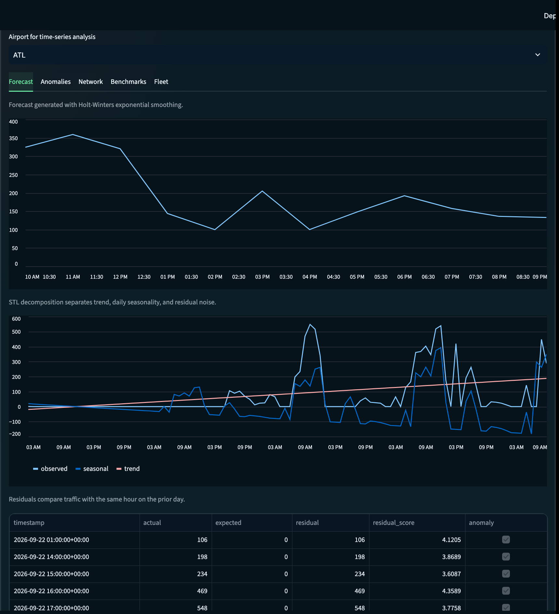
</p>

### Research Lab

Experimental views. Where a technique is a simplified stand-in for something heavier, the app and the module docstrings say so.

<table>
  <tr>
    <td width="50%">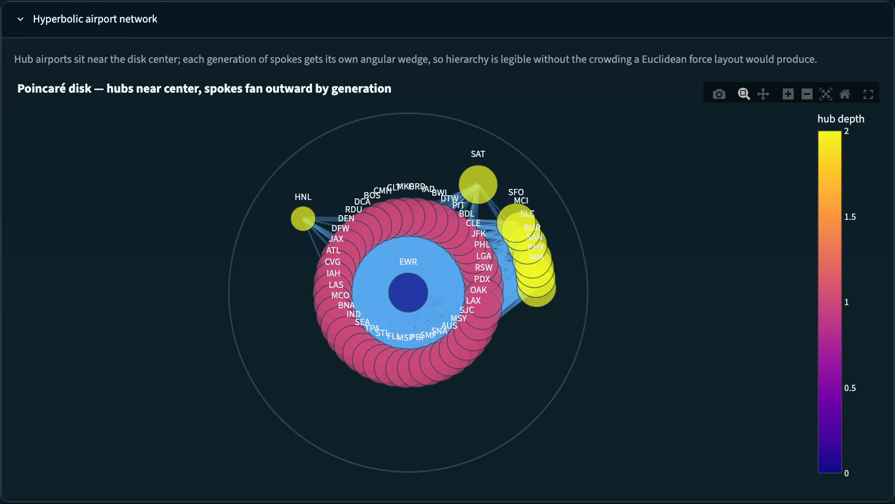<br><sub><b>Hyperbolic airport network</b> — the airport graph on a Poincaré disk</sub></td>
    <td width="50%">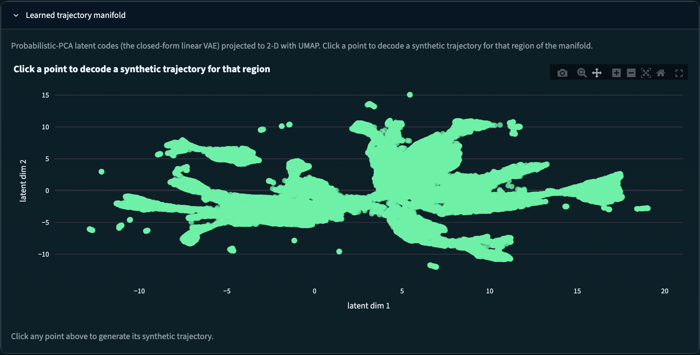<br><sub><b>Trajectory manifold</b> — flights as points in a learned latent space</sub></td>
  </tr>
  <tr>
    <td width="50%">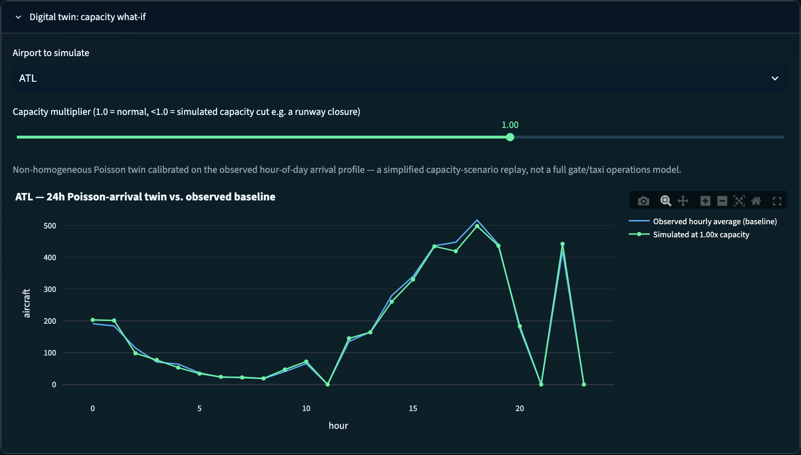<br><sub><b>Digital twin</b> — cut an airport's capacity and watch traffic respond</sub></td>
    <td width="50%">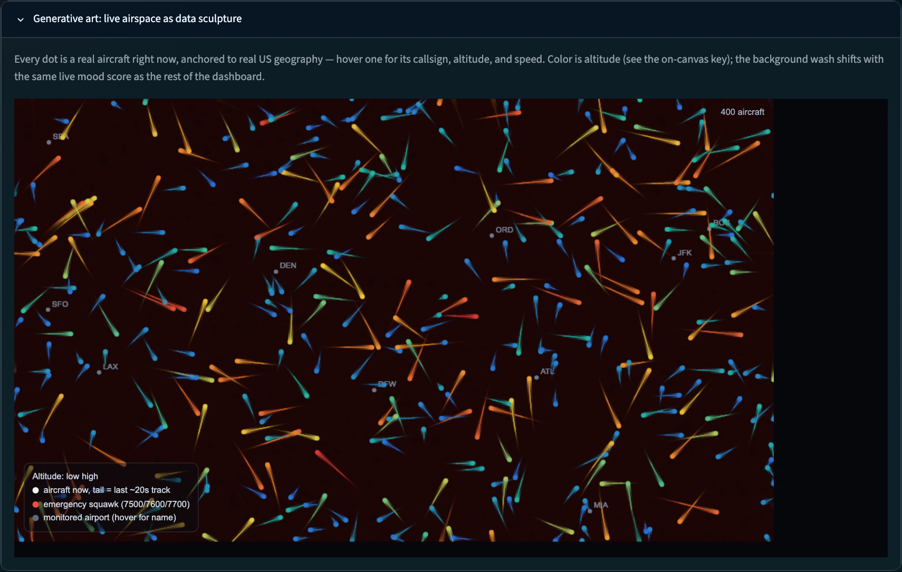<br><sub><b>Generative art</b> — every dot is a real aircraft, colored by altitude</sub></td>
  </tr>
</table>

The Research Lab also includes persistent homology (the shape of traffic patterns over time), which needs several collected days before it has anything to show.

## Running locally

```bash
python3 -m venv venv
source venv/bin/activate
pip install -r requirements.txt
streamlit run app.py
```

The first run downloads two small/medium reference datasets automatically (OpenFlights airline codes, the OpenSky aircraft database) — no manual setup needed.

## What's in here

- `app.py` — the dashboard
- `scripts/ingest_flights.py` — pulls live positions from ADSB.lol
- `scripts/aircraft_registry.py` / `scripts/metadata.py` — airline/aircraft enrichment
- `scripts/` (the rest) — each analytics/visualization feature is its own small module; see their docstrings for what they do and, where a technique is more research-flavored than production-grade, an honest note on the tradeoff

## Keeping data fresh

The dashboard refreshes itself while someone has it open in a browser. For continuous background collection independent of viewers, schedule `scripts/ingest_flights.py` to run every few minutes (e.g. via cron) on any always-on machine.

Note: on ephemeral hosting (like Streamlit Community Cloud's free tier), collected history resets whenever the app's container restarts — there's no persistent disk. It self-heals by re-collecting on the next visit, but it isn't a durable historical archive without adding external storage. The screenshots above were taken from a local copy that had accumulated several days of history, so the public demo shows smaller numbers.

## Data notes

The dashboard shows aircraft observed within 160 km of the monitored airports. This is proximity activity, not confirmed arrivals or destinations.
